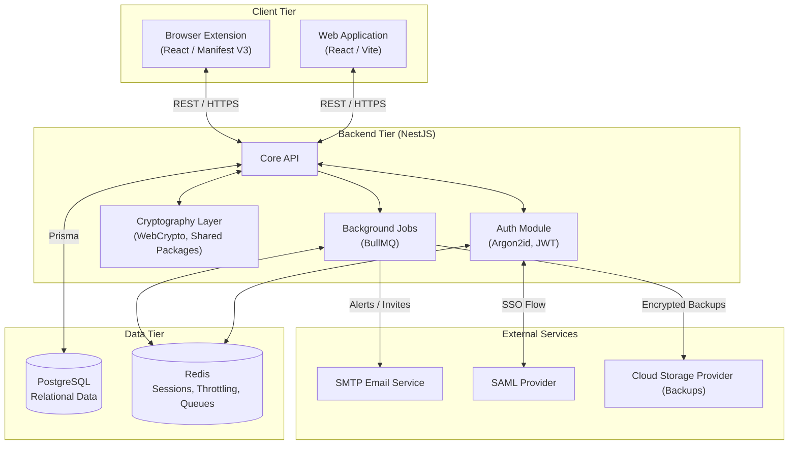

# SecureVault Architecture

```mermaid
flowchart TD
    subgraph Client ["Client Tier"]
        WA["Web Application<br/>(React / Vite)"]
        BE["Browser Extension<br/>(React / Manifest V3)"]
    end

    subgraph Backend ["Backend Tier (NestJS)"]
        API["Core API"]
        Auth["Auth Module<br/>(Argon2id, JWT)"]
        Crypto["Cryptography Layer<br/>(WebCrypto, Shared Packages)"]
        Jobs["Background Jobs<br/>(BullMQ)"]
    end

    subgraph Data ["Data Tier"]
        PG[("PostgreSQL<br/>Relational Data")]
        Redis[("Redis<br/>Sessions, Throttling, Queues")]
    end

    WA <-->|REST / HTTPS| API
    BE <-->|REST / HTTPS| API
    
    API <--> Auth
    API <--> Crypto
    API --> Jobs
    
    API <-->|Prisma| PG
    Auth <--> Redis
    Jobs <--> Redis

    subgraph External ["External Services"]
        Mail["SMTP Email Service"]
        IdP["SAML Provider"]
        Storage["Cloud Storage Provider (Backups)"]
    end

    Jobs -->|Alerts / Invites| Mail
    Auth <-->|SSO Flow| IdP
    Jobs -->|Encrypted Backups| Storage
```
