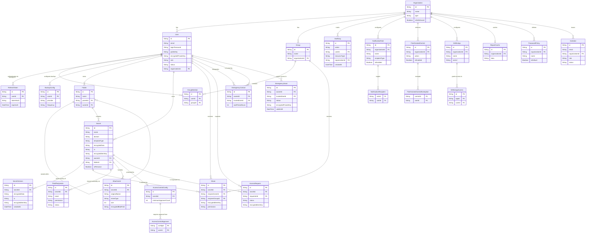

# SecureVault Database ERD

```mermaid
erDiagram
    Organization {
        String id PK
        String name
        String type
        Boolean mfaEnforced
    }

    PasswordPolicy {
        String id PK
        String organizationId FK
        String name
        Boolean isDefault
    }

    User {
        String id PK
        String email
        String loginPassword
        String publicKey
        String encryptedPrivateKey
        String role
        String status
        String organizationId FK
    }

    RefreshToken {
        String id PK
        String userId FK
        String tokenHash
        DateTime expiresAt
    }

    Invitation {
        String id PK
        String email
        String organizationId FK
        String role
        String status
    }

    Group {
        String id PK
        String name
        String organizationId FK
    }

    GroupMember {
        String id PK
        String userId FK
        String groupId FK
    }

    Folder {
        String id PK
        String name
        String parentId FK
        String ownerId FK
    }

    Secret {
        String id PK
        String name
        String domain
        String templateType
        String encryptedData
        String iv
        String encryptedItemKey
        String ownerId FK
        String folderId FK
        Boolean isPersonal
    }

    SecretVersion {
        String id PK
        String secretId FK
        String encryptedData
        String iv
        String encryptedItemKey
        DateTime createdAt
    }

    Share {
        String id PK
        String secretId FK
        String recipientUserId FK
        String recipientGroupId FK
        String encryptedItemKey
        String permission
    }

    ThirdPartyInvite {
        String id PK
        String secretId FK
        String email
        String permission
        String status
    }

    Attachment {
        String id PK
        String secretId FK
        String originalName
        String mimeType
        Int size
        String encryptedBlobPath
    }

    AccessControlConfig {
        String id PK
        String secretId FK
        Int minimumApproverCount
    }

    AccessControlApprover {
        String configId FK
        String userId FK
    }

    AccessRequest {
        String id PK
        String secretId FK
        String requesterId FK
        String status
        String encryptedItemKey
    }

    EmergencyContact {
        String id PK
        String ownerId FK
        String trustedUserId FK
        Int waitPeriodHours
    }

    EmergencyGrant {
        String id PK
        String ownerId FK
        String trustedUserId FK
        String status
        String encryptedPrivateKey
        DateTime validUntil
    }

    AuditLog {
        String id PK
        String action
        String userId FK
        String resourceType
        String organizationId FK
        DateTime createdAt
    }

    NotificationRule {
        String id PK
        String organizationId FK
        String name
        String recipientType
        Boolean isEnabled
    }

    NotificationRecipient {
        String ruleId FK
        String userId FK
    }

    FineGrainedControl {
        String id PK
        String organizationId FK
        String action
        Boolean isEnabled
    }

    FineGrainedControlExemption {
        String controlId FK
        String userId FK
    }

    SAMLApp {
        String id PK
        String organizationId FK
        String name
        String acsUrl
    }

    SAMLAppAccess {
        String id PK
        String appId FK
        String userId FK
    }

    BackupConfig {
        String id PK
        String userId FK
        String provider
        String frequency
    }

    ReportCache {
        String id PK
        String organizationId FK
        String data
    }

    Organization ||--o{ User : "has"
    Organization ||--o{ Group : "has"
    Organization ||--o{ AuditLog : "tracks"
    Organization ||--o{ NotificationRule : "configures"
    Organization ||--o{ FineGrainedControl : "enforces"
    Organization ||--o{ SAMLApp : "configures"
    Organization ||--o| ReportCache : "caches"
    Organization ||--o{ PasswordPolicy : "defines"
    Organization ||--o{ Invitation : "issues"

    NotificationRule ||--o{ NotificationRecipient : "targets"
    FineGrainedControl ||--o{ FineGrainedControlExemption : "exempts"
    SAMLApp ||--o{ SAMLAppAccess : "grants access to"

    User ||--o{ GroupMember : "belongs to"
    Group ||--o{ GroupMember : "contains"
    
    User ||--o{ RefreshToken : "authenticates via"
    User ||--o{ BackupConfig : "configures backup"
    User ||--o{ Folder : "owns"
    User ||--o{ Secret : "owns"
    
    Folder ||--o{ Folder : "nested within"
    Folder ||--o{ Secret : "contains"

    Secret ||--o{ SecretVersion : "tracks history of"
    Secret ||--o{ Share : "is shared via"
    Secret ||--o{ ThirdPartyInvite : "shared externally via"
    Secret ||--o{ Attachment : "has files"
    Secret ||--o| AccessControlConfig : "protected by"
    Secret ||--o{ AccessRequest : "is requested via"

    AccessControlConfig ||--o{ AccessControlApprover : "requires approval from"

    User ||--o{ Share : "receives"
    Group ||--o{ Share : "receives"
    User ||--o{ AccessRequest : "requests"
    
    User ||--o{ EmergencyContact : "designates"
    User ||--o{ EmergencyContact : "is trusted by"
    User ||--o{ EmergencyGrant : "grants access to"
```
