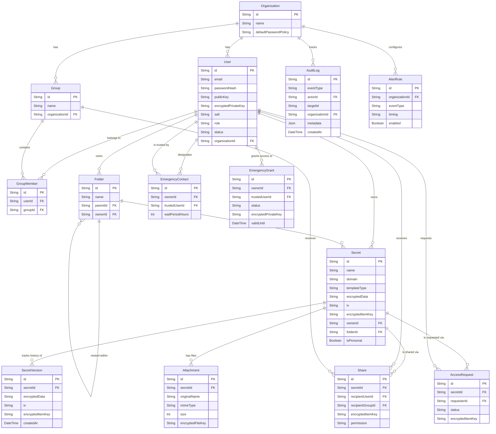

# SecureVault Database ERD

This diagram visualizes the PostgreSQL database schema as outlined in TRD Section 9.

```mermaid
erDiagram
    Organization {
        String id PK
        String name
        String defaultPasswordPolicy
    }

    User {
        String id PK
        String email
        String passwordHash
        String publicKey
        String encryptedPrivateKey
        String salt
        String role
        String status
        String organizationId FK
    }

    Group {
        String id PK
        String name
        String organizationId FK
    }

    GroupMember {
        String id PK
        String userId FK
        String groupId FK
    }

    Folder {
        String id PK
        String name
        String parentId FK
        String ownerId FK
    }

    Secret {
        String id PK
        String name
        String domain
        String templateType
        String encryptedData
        String iv
        String encryptedItemKey
        String ownerId FK
        String folderId FK
        Boolean isPersonal
    }

    SecretVersion {
        String id PK
        String secretId FK
        String encryptedData
        String iv
        String encryptedItemKey
        DateTime createdAt
    }

    Share {
        String id PK
        String secretId FK
        String recipientUserId FK
        String recipientGroupId FK
        String encryptedItemKey
        String permission
    }

    Attachment {
        String id PK
        String secretId FK
        String originalName
        String mimeType
        Int size
        String encryptedFileKey
    }

    AccessRequest {
        String id PK
        String secretId FK
        String requesterId FK
        String status
        String encryptedItemKey
    }

    EmergencyContact {
        String id PK
        String ownerId FK
        String trustedUserId FK
        Int waitPeriodHours
    }

    EmergencyGrant {
        String id PK
        String ownerId FK
        String trustedUserId FK
        String status
        String encryptedPrivateKey
        DateTime validUntil
    }

    AuditLog {
        String id PK
        String eventType
        String actorId FK
        String targetId
        String organizationId FK
        Json metadata
        DateTime createdAt
    }

    AlertRule {
        String id PK
        String organizationId FK
        String eventType
        String timing
        Boolean enabled
    }

    Organization ||--o{ User : "has"
    Organization ||--o{ Group : "has"
    Organization ||--o{ AuditLog : "tracks"
    Organization ||--o{ AlertRule : "configures"

    User ||--o{ GroupMember : "belongs to"
    Group ||--o{ GroupMember : "contains"
    
    User ||--o{ Folder : "owns"
    User ||--o{ Secret : "owns"
    
    Folder ||--o{ Folder : "nested within"
    Folder ||--o{ Secret : "contains"

    Secret ||--o{ SecretVersion : "tracks history of"
    Secret ||--o{ Share : "is shared via"
    Secret ||--o{ Attachment : "has files"
    Secret ||--o{ AccessRequest : "is requested via"

    User ||--o{ Share : "receives"
    Group ||--o{ Share : "receives"
    User ||--o{ AccessRequest : "requests"
    
    User ||--o{ EmergencyContact : "designates"
    User ||--o{ EmergencyContact : "is trusted by"
    User ||--o{ EmergencyGrant : "grants access to"
```
